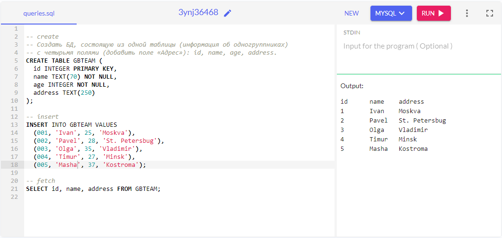

# Основы бэкенда: PHP и MySQL

## Задача №1: 

Сформировать массив с данными для блока «Опыт работы». Вывести данные массива в HTML-шаблоне.

Скриншоты

---

## Задача №2: 

Создать БД, состоящую из одной таблицы (информация об одногруппниках) с четырьмя полями (добавить поле «Адрес»): id, name, age, address.

---

## Дополнительно

Прочитать 1-ую главу из книги ("SQL для простых смертных") и ответить на вопросы после 1-ой главы

